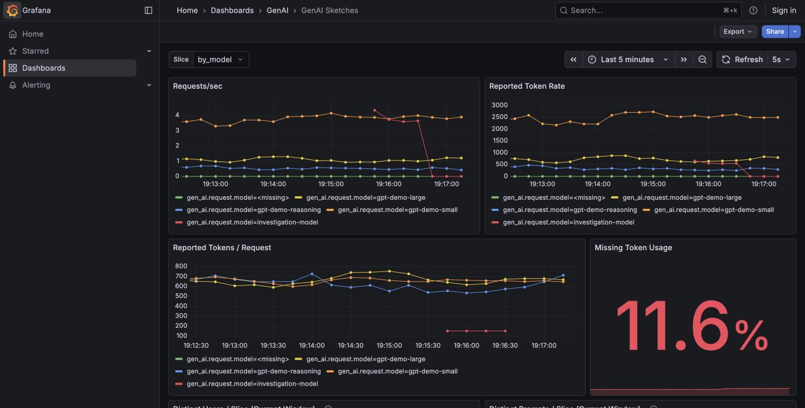

# otelcol-genai-sketches

[](https://github.com/llm-measurement/otelcol-genai-sketches/actions/workflows/ci.yml)
[](LICENSE)

An OpenTelemetry Collector distribution for continuous, bounded answers about
high-cardinality agent traffic without exporting or indexing every underlying value.
It turns GenAI traces into bounded Prometheus metrics and keyed top-k summaries.

Use it alongside an existing trace backend to find where reported token volume is
accumulating, measure missing usage, and keep high-cardinality identities out of
metric labels.



Actual output from synthetic traffic. Start with the
[90-second walkthrough](docs/media/README.md), or try two reproducible investigations:
[more tool spans, the same model requests](docs/investigations/TOOL_SPANS.md) and
[fewer reported tokens, unchanged synthetic consumption](docs/investigations/MISSING_USAGE.md).

## Start With The Question

| Question | Required span data | Result | Boundary |
| --- | --- | --- | --- |
| Where is reported token or request volume accumulating? | A matched model operation, optional token fields, and bounded attributes such as team, model, provider, or route | Request and token rates by bounded slice, plus token-weighted prompt signatures with lower and upper bounds | Volume does not establish task value, waste, or root cause |
| Could an identity create unsafe Prometheus cardinality? | A supported user, prompt, document, or MCP field configured as a hashed field | Distinct estimates remain metrics; keyed identities remain outside labels | The connector does not scan every arbitrary attribute for cardinality |
| Are agent or tool spans inflating model-request accounting? | `gen_ai.operation.name`, or the documented model fallback | Only configured model operations count as requests; root agent runs have a separate counter | The connector does not provide a count for every possible span kind |
| How much reported token usage is incomplete? | `gen_ai.usage.input_tokens` and `gen_ai.usage.output_tokens` when available | A request with either aggregate field unavailable is counted separately from real zero-token values | The collector never infers unreported tokens |
| Can separately operated agent systems combine measurements without pooling raw telemetry? | Compatible [window summary files](docs/SUMMARY_EXCHANGE.md) from collectors observing disjoint request streams | Combined counters, distinct estimates, and heavy items, with missing producers and partial windows reported | Opt-in source-build feature; overlapping requests are not deduplicated |

Prometheus metrics describe each collector's observations. The optional summary
exchange combines compatible sketch state across independently operated systems;
adding distinct-count metrics or top-k log entries cannot do this. Trace explorers
and evaluation systems remain the right tools for understanding one agent run or
judging its output.

## Quick Start

Requirements: Docker with Compose v2, Git, and a POSIX shell (macOS, Linux, or WSL).
No host Go, Python, Make, or OpenSSL installation is needed.

```bash
git clone https://github.com/llm-measurement/otelcol-genai-sketches.git
cd otelcol-genai-sketches
sh examples/demo.sh up
```

This starts a sample application, the collector, a Prometheus metrics server, and a
provisioned Grafana dashboard.

The first run downloads pinned images and compiles the checked-out collector inside
Docker. Allow several minutes; later runs reuse the build cache. `make example-up`
is an equivalent convenience command. This is a source-built demo, not a download
of a prebuilt release image.

The script generates a random demo secret without displaying it. Each `up` creates
a fresh secret unless `GENAI_SKETCH_SECRET` is already set. Restarting with a new
secret resets pseudonymous comparability. Everything is synthetic; no model account
or API key is required. Published ports bind only to localhost.

- Grafana: [http://localhost:3000](http://localhost:3000)
- Prometheus: [http://localhost:9090](http://localhost:9090)
- Collector metrics: [http://localhost:8889/metrics](http://localhost:8889/metrics)

The sample emits model, agent, tool, and retrieval spans. It also includes missing
token fields and enough prompt variety to exercise bounded estimates.

### Get A Useful Result

Let the example run for at least one minute, then use the dashboard in this order:

1. Compare **Requests/sec** with **Reported Token Rate**.
2. Check **Reported Tokens / Request** to separate traffic growth from larger
   requests or responses.
3. Check **Missing Token Usage** before treating token totals as complete.
4. Compare model and team/model slices to localize the change.

Then inspect the high-cardinality surface:

```bash
sh examples/demo.sh logs \
  | grep 'genaisketch topk snapshot'
```

The snapshot contains keyed hashes, estimates, and lower and upper bounds. It does
not contain prompt text, and its hashes never become Prometheus labels.

Stop the example with:

```bash
sh examples/demo.sh down
```

This removes the demo containers and their disposable data. If a port is occupied,
set `GENAI_DEMO_GRAFANA_PORT`, `GENAI_DEMO_PROMETHEUS_PORT`,
`GENAI_DEMO_METRICS_PORT`, or `GENAI_DEMO_OTLP_PORT` before starting; the defaults are
3000, 9090, 8889, and 4317 respectively.

The [token-consumption playbook](docs/TOKEN_USAGE.md) contains the PromQL queries and
an interpretation table for the same workflow.

For a persistent environment, use the production image and Helm chart produced by a
tagged release, as described in [Deployment](docs/DEPLOYMENT.md). Release images are
signed for both supported architectures. The demo image and Compose stack are not
the production package.

## Keep Your Current Backend

You can add the connector without replacing Datadog, Langfuse, Alloy, or another
OTLP destination:

```text
applications -> Collector fan-out -> current trace backend
                                  -> bounded sketch metrics
```

The distribution includes OTLP gRPC and HTTP exporters. CI verifies that one trace
batch can be forwarded while the connector derives metrics from it. You can also let
an existing Collector or Alloy deployment own the fan-out and run this distribution
as a sidecar.

See [Keep Your Existing Telemetry Backend](docs/SHADOW_MODE.md) for tested generic
OTLP configurations and coexistence paths for an ordinary Collector, Datadog,
Langfuse, and Grafana Alloy.

## Across Independent Systems

Separate teams can keep their trace backends and exchange bounded window summaries
for a shared view of an agent fleet. Export includes full sketch state and counters,
not raw prompts or identities. A [local Go/Python API](https://github.com/llm-measurement/llm-sketchkit/tree/main/examples/summary-exchange)
combines the files without needing the hashing secret. Replayed snapshots are not
counted again, and missing producers and partial observation windows are reported.

This requires agreed scopes, hashing keys, accounting rules, and disjoint request
streams. It does not authenticate producers, discover fleets, or enforce policy.
See [Combine Measurements Across Independently Operated Systems](docs/SUMMARY_EXCHANGE.md)
for configuration, a working example, and restart and privacy limits. This feature
is available in the source checkout, not previously published collector images.

## When This Fits

Use this collector when you need to:

- keep metric cardinality bounded across a large GenAI or agent workload;
- estimate distinct users, prompt signatures, or retrieval documents without
  placing raw values in aggregate state;
- separate real zero-token usage from requests that omitted token attributes;
- investigate unexpected or runaway token consumption, sometimes called
  "token maxing," by locating where reported tokens accumulate;
- inspect token-heavy prompt signatures without turning them into labels; or
- count model requests without including agent, tool, retrieval, workflow, and MCP
  spans in the same denominator.

This is not a prompt logger, billing ledger, arbitrary attribute-to-label converter,
anomaly detector, loop stopper, budget enforcer, or differential-privacy system.

If exact traces are safe to retain and remain fast and affordable to query, use them.
The connector is an always-on bounded evidence surface, not a replacement for raw
records needed for diagnosis, audit, or replay.

## What It Produces

| Signal | Meaning |
| --- | --- |
| `gen_ai_sketch_requests_total` | Model request spans matched by the operation filter |
| `gen_ai_sketch_agent_runs_total` | Root `invoke_agent` spans |
| `gen_ai_sketch_input_tokens_total` | Reported input tokens |
| `gen_ai_sketch_output_tokens_total` | Reported output tokens |
| `gen_ai_sketch_total_tokens_total` | Reported input plus output tokens |
| `gen_ai_sketch_cache_read_input_tokens_total` | Reported cache-read input tokens; a subset of input |
| `gen_ai_sketch_cache_write_input_tokens_total` | Reported cache-write input tokens; a subset of input |
| `gen_ai_sketch_reasoning_output_tokens_total` | Reported reasoning output tokens; a subset of output |
| `gen_ai_sketch_missing_token_usage_total` | Matched requests missing either aggregate token field |
| `gen_ai_sketch_token_field_observations_total` | Fixed-state token completeness and quality observations |
| `gen_ai_sketch_active_slices` | Currently retained slice states |
| `gen_ai_sketch_distinct_users` | Estimated distinct keyed user values |
| `gen_ai_sketch_distinct_prompt_signatures` | Estimated distinct keyed prompt values |
| `gen_ai_sketch_distinct_retrieval_docs` | Estimated distinct keyed document values |

Optional MCP metrics estimate distinct sessions, methods, and resources. Weighted
top-k prompt signatures are emitted as structured logs with estimates and lower and
upper bounds. They never become Prometheus labels. Set `topk: 0` to disable the
structured-log surface and its frequent-items state.

See [Production Accounting Semantics](docs/ACCOUNTING.md) for the versioned
accounting contract and [Metrics](docs/METRICS.md) for the exported surface.

## How It Fits

```text
GenAI applications -> OTLP traces -> this collector -> Prometheus metrics
                                      |              -> bounded structured logs
                                      +--------------> optional existing OTLP backend
```

Use this distribution when source spans already flow through OpenTelemetry. If you
own a custom streaming, batch, or warehouse pipeline and do not need OTLP-to-metrics
conversion, use [llm-sketchkit](https://github.com/llm-measurement/llm-sketchkit)
directly.

The connector uses `llm-sketchkit` for canonicalization, keyed hashing,
distinct counting, frequent-item estimates, and deduplication. Raw prompt text,
user IDs, document IDs, and request IDs do not enter connector aggregate state or
its derived metrics and snapshots.

An optional forwarded trace remains the original trace. If instrumentation captured
raw content, the existing trace backend still receives it. See the shadow-mode guide
before enabling fan-out.

## Use In An Existing Collector

The connector is also published as a standalone Go module for the
[OpenTelemetry Collector Builder](https://opentelemetry.io/docs/collector/extend/ocb/).
Add it to a builder manifest:

```yaml
connectors:
  - gomod: github.com/llm-measurement/otelcol-genai-sketches/connector/genaisketchconnector v0.1.0-alpha.2
```

Configure `genaisketch` as an exporter from the traces pipeline and a receiver in the
metrics pipeline. The `path:` override in this repository's builder manifest exists
only for a local checkout.

## Configuration

Start with [the example configuration](examples/collector/config.yaml). The connector
requires a secret of at least 16 bytes from `GENAI_SKETCH_SECRET` by default.

```yaml
connectors:
  genaisketch:
    window_duration: 1m
    retention_windows: 10
    max_slices: 2000
    topk: 20
    slices:
      - name: model
        keys: [gen_ai.request.model]
        from_resource_attributes: [gen_ai.request.model]
```

Slice values are exported in cleartext as Prometheus labels. Use only bounded,
low-cardinality, non-sensitive attributes such as model, team, route, or provider.
Configured slice capacity uses deterministic inactive-slice eviction and one
`__overflow__` value. Excess traffic is counted rather than silently dropped, and it
does not create new label values.

See [Configuration](docs/CONFIGURATION.md) for field mapping, operation filtering,
resource fallback, MCP support, deduplication, and capacity limits.

## Security And Privacy

Keyed hashes are pseudonymous, not anonymous. Values remain linkable while the same
secret is in use, and anyone holding the secret can test candidate values. Rotating
the secret breaks comparison with earlier windows.

The structured top-k surface contains keyed hashes and bounded estimates. Treat
collector logs as sensitive operational data even though raw source values are not
included, or set `topk: 0` to disable that surface. The connector rejects known
high-cardinality MCP identifiers as slice keys and rejects overlap between plaintext
slice keys and configured hashed fields.

Token attributes are optional. Missing or invalid aggregate usage is counted
explicitly; the connector does not invent token weights. Bloom-filter deduplication
is bounded and may undercount because false positives are possible. It is not a
billing or quota ledger.

See [Security](SECURITY.md) to report a vulnerability privately.

## Evidence

Recorded local measurements include:

- 36 million spans accepted and exported over 60 minutes at 10,000 spans/second;
- exact request filtering across a 36 million-span mixed tree workload: 10.8 million
  emitted model spans and 10.8 million counted requests;
- exact missing-usage accounting for 1.08 million planted missing-token model spans;
- 528,924 spans/second in the mixed in-process benchmark; and
- 1,386.8 MiB maximum collector RSS in the mixed fleet-shaped soak.

These are measurements from one Apple M4 Max system, not universal capacity claims.
Workload definitions, machine details, commands, and non-passing runs are in
[Benchmarks](docs/BENCHMARKS.md).

## Development

```bash
make tidy
make check
make dist
make test-integration
```

Packaging checks are available with `make production-image` and `make helm-check`.
See [Sizing](docs/SIZING.md) and [Upgrading](docs/UPGRADING.md) before a production
rollout.

The integration suite covers OTLP-to-Prometheus behavior, gRPC and HTTP shadow-mode
fan-out, bounded overflow, deterministic eviction, restart stability, tree locality,
and sentinel scans across metric, label, and structured-log surfaces.

## Status

**Current status: Alpha.** The connector is ready for evaluation and limited,
non-critical workloads. Signed multi-architecture images, a Helm chart, SBOMs,
provenance, upgrade guidance, and production-shaped tests are provided.
Configuration and metric semantics may still change before 1.0. Pin an exact
release and image digest, then validate it against representative traffic. See the
[changelog](CHANGELOG.md) for release notes and the
[release and support policy](SUPPORT.md) for the supported release line.

Licensed under the [Apache License 2.0](LICENSE).
