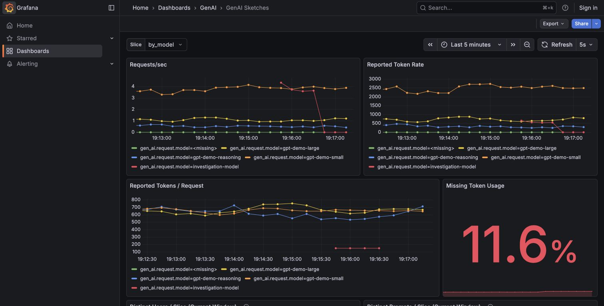

# otelcol-genai-sketches

[](https://github.com/llm-measurement/otelcol-genai-sketches/actions/workflows/ci.yml)
[](LICENSE)
[](https://scorecard.dev/viewer/?uri=github.com/llm-measurement/otelcol-genai-sketches)

**How do you track LLM token usage by user and session without a Prometheus
cardinality explosion?**

`genaisketch` is an OpenTelemetry Collector connector and ready-to-run
distribution that turns GenAI spans into Prometheus metrics, keyed contributor
rankings and summary files, while keeping user, session and prompt identities
out of metric labels.

See where reported tokens accumulate and where usage data is missing, while
your existing trace backend keeps receiving the original spans.

| Status | |
| --- | --- |
| Stability | alpha: traces to metrics |
| Distributions | this repository's collector image and Helm chart; the connector module for custom builds |
| Issues | [open issues](https://github.com/llm-measurement/otelcol-genai-sketches/issues) |
| Code owners | @kwisatzh |



*Synthetic demo traffic.*

## Try It

You need Docker with Compose v2, Git, and a POSIX shell (macOS, Linux, or WSL).
The demo is synthetic and needs no model account or API key.

Clone the repository and start the stack:

```sh
git clone https://github.com/llm-measurement/otelcol-genai-sketches.git
cd otelcol-genai-sketches
sh examples/demo.sh up
```

You'll get a sample app, this collector, a Prometheus metrics server, and Grafana.
Open the dashboard printed by the command to see request rate, reported token
rate, distinct activity, and missing usage. The first build takes several minutes;
allow one minute after startup for the first measurement window.

See the token-heavy prompt signatures and their bounds:

```sh
sh examples/demo.sh topk
```

Then run two controlled investigations:

```sh
sh examples/demo.sh investigate
```

You'll see why adding tool spans leaves model-request counts unchanged, and why
missing usage can make reported tokens fall while consumption stays the same.

[Watch the walkthrough](docs/media/README.md), or open the
[demo guide](examples/README.md) for ports, secret handling, dashboard reading
order, and cleanup. The [token-consumption playbook](docs/TOKEN_USAGE.md) gives
queries for investigating your own traffic, including unexpected "token maxing."

## Find Your Guide

| Your path | Start here | What you'll see |
| --- | --- | --- |
| LiteLLM | [Single-app before/after recipe](examples/integrations/litellm/README.md) | More requests or larger requests, missing usage, and an optional two-stack comparison |
| agentgateway or Envoy AI Gateway | [agentgateway](examples/integrations/agentgateway/README.md) / [standalone Envoy](examples/integrations/envoy-ai-gateway/README.md) | Users and sessions taking over while totals stay flat; workflow rankings in snapshot logs |
| Copilot CLI or Copilot Chat | [Coding-agent recipe](examples/integrations/coding-agents/README.md) | Session changes and separate device rankings, using source-specific field mappings |
| Claude Code and Codex traces (TraceLab) | [Replay the recorded investigation](examples/tracelab/README.md) | Three sessions behind a 17% overnight token increase, checked against source totals |
| Kubernetes summary files and alerts | [Export and readback](docs/SUMMARY_EXPORT_HELM.md) / [alerts](docs/ALERTING.md) | Local `investigate` and `scan`, plus optional Prometheus alerts |
| Several teams or collectors | [Summary exchange](docs/SUMMARY_EXCHANGE.md) / [fleetdiff](https://github.com/llm-measurement/fleetdiff) | Combine compatible measurements and compare windows while each team keeps its backend |

## How It Works

```text
applications -> Collector fan-out -> current trace backend
                                  -> genaisketch -> Prometheus metrics
                                                -> keyed top-k snapshot logs
                                                -> optional summary files -> fleetdiff
```

Keep Datadog, Langfuse, Alloy, or another OTLP destination as your trace backend.
The connector counts model attempts separately from agent, tool, retrieval, and
MCP spans, and records missing token usage explicitly.
It uses [llm-sketchkit](https://github.com/llm-measurement/llm-sketchkit) to hash
configured identities, estimate distinct activity, and rank heavy contributors.
Compatible summary files let [fleetdiff](https://github.com/llm-measurement/fleetdiff)
compare windows across collectors without uploading raw traces.
Fan-out preserves the original traces, so disable content capture or redact
before fan-out when raw content must stay local.

See [Shadow Mode](docs/SHADOW_MODE.md) for fan-out configurations and
[Accounting](docs/ACCOUNTING.md) for request and token rules.
The [metrics reference](docs/METRICS.md), [configuration guide](docs/CONFIGURATION.md),
and [deployment FAQ](docs/FAQ.md#can-i-use-this-with-self-hosted-models-or-a-mix-of-providers)
cover the available signals and required input fields.

## Install

For a persistent deployment, use the signed release image or Helm chart.
Follow [Deployment](docs/DEPLOYMENT.md) to verify signatures and attestations,
pin immutable digests, configure the hashing secret, and start the collector.

| Artifact | Released version | Reference |
| --- | --- | --- |
| Collector image | `v0.3.1` | `ghcr.io/llm-measurement/otelcol-genai-sketches` |
| Helm chart | `0.3.3` | `oci://ghcr.io/llm-measurement/charts/otelcol-genai-sketches` |

The image supports Linux amd64 and arm64. For Kubernetes, the deployment guide
includes the verified chart install and an existing-Secret configuration.

Already build your own collector? Add the standalone connector module to your
[OpenTelemetry Collector Builder](https://opentelemetry.io/docs/collector/extend/ocb/)
manifest:

```yaml
connectors:
  - gomod: github.com/llm-measurement/otelcol-genai-sketches/connector/genaisketchconnector v0.3.1
```

Use `genaisketch` as a traces-pipeline exporter and a metrics-pipeline receiver;
the [component README](connector/genaisketchconnector/README.md) and
[configuration guide](docs/CONFIGURATION.md) have the connector settings.
Read [Sizing](docs/SIZING.md) for capacity planning and
[Upgrading](docs/UPGRADING.md) for feature availability, restarts, and rollback.

## Privacy And Limits

- **Keyed hashes are pseudonymous.** Values are linkable under the same secret;
  secret holders can test candidate values. Restrict access to snapshots and
  summary files. Key rotation starts a new comparison period.
- **Slice labels are bounded and cleartext.** Choose non-sensitive dimensions
  such as model, team, or route. Excess slice values share an overflow bucket;
  user/session hashes and top-k items stay out of metric labels.
- **Estimates carry uncertainty.** Distinct counts are estimates; frequent-item
  rankings include lower and upper bounds. Use compatible summary state to
  combine measurements, rather than adding distinct-count gauges.
- **Use exact records for billing and quota enforcement.** Reported usage and
  coverage support investigation; optional Bloom deduplication can undercount.
  Keep provider records and an exact ledger for financial or admission decisions.

See [Security](SECURITY.md) for private vulnerability reporting and
[Accounting](docs/ACCOUNTING.md) for measurement semantics.

## Project

**Status: Alpha.** Signed images, a Helm chart, SBOMs, provenance, and upgrade
guidance are available. Start with an evaluation deployment and representative
traffic; configuration and metric semantics may change before 1.0.
See the [changelog](CHANGELOG.md) and [release and support policy](SUPPORT.md).

The [benchmark report](docs/BENCHMARKS.md) records reproduction commands, workloads,
machine details, and all recorded accuracy, throughput, and soak runs.

[Contributing](CONTRIBUTING.md) covers development and signed, signed-off commits.
For questions or feedback, [open an issue](https://github.com/llm-measurement/otelcol-genai-sketches/issues/new/choose).

Licensed under the [Apache License 2.0](LICENSE).
