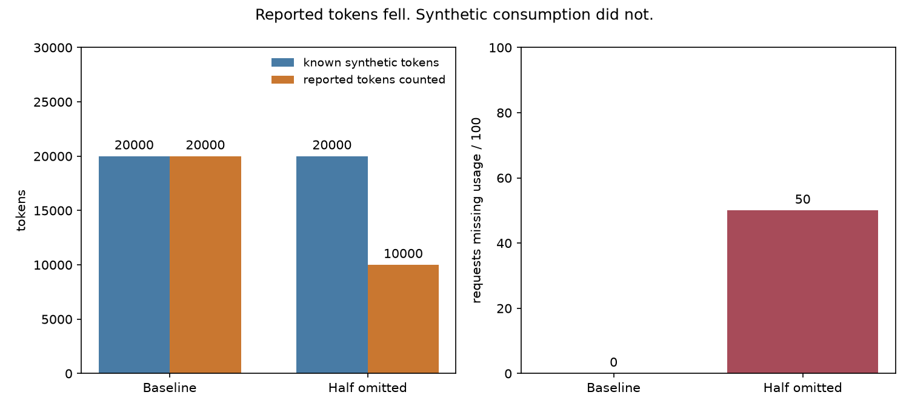

# Did Token Consumption Fall, Or Did Usage Go Missing?

A lower token total is not necessarily a saving. The collector can only count token
fields that instrumentation reports.

## Run It

```sh
sh examples/demo.sh up
sh examples/demo.sh investigate
```

Run these from the repository root with Docker and Compose v2. The investigation
uses the existing demo, emits synthetic spans, and reconciles each batch through
Prometheus. No model credentials or host language runtime are needed.

## Observed Result

Captured on 2026-09-04 from the running collector. [Full JSON output](results.json).

| Batch | Model requests | Known synthetic tokens | Reported tokens counted | Requests missing usage |
| --- | ---: | ---: | ---: | ---: |
| Baseline | 100 | 20,000 | 20,000 | 0 |
| Missing usage on half | 100 | 20,000 | 10,000 | 50 |



Every model request has 120 input and 80 output tokens in the generator's known
synthetic workload. The second batch omits both usage attributes on every other
model span. The collector sees 10,000 reported tokens and 50 incomplete requests.
It cannot recover the other 10,000 tokens from those spans.

## Read It Correctly

The reported token total fell 50%; synthetic consumption did not. Missing usage
explains the difference in this controlled test. In real traffic, missing usage is
a warning about completeness, not proof of how many tokens were consumed.

In Prometheus, select one slice definition when computing the missing fraction:

```promql
sum(rate(gen_ai_sketch_missing_token_usage_total{slice="by_model"}[5m]))
/
sum(rate(gen_ai_sketch_requests_total{slice="by_model"}[5m]))
```

This query includes the continuously running demo traffic. The investigation script
instead isolates `investigation-model` and checks exact counter increments for its
short batches. It does not use interpolated `increase()` values as ground truth.

A present zero is different from an absent or invalid field. The connector counts
a matched model request as incomplete when either aggregate token field is
unavailable. Cache and reasoning details do not get added to the aggregate totals
again. See [Accounting](../ACCOUNTING.md) for these cases and their fixtures.

The workload is in [investigate.py](../../examples/app/investigate.py), with generator
tests and a live CI check. Stop the disposable demo with `sh examples/demo.sh down`.
