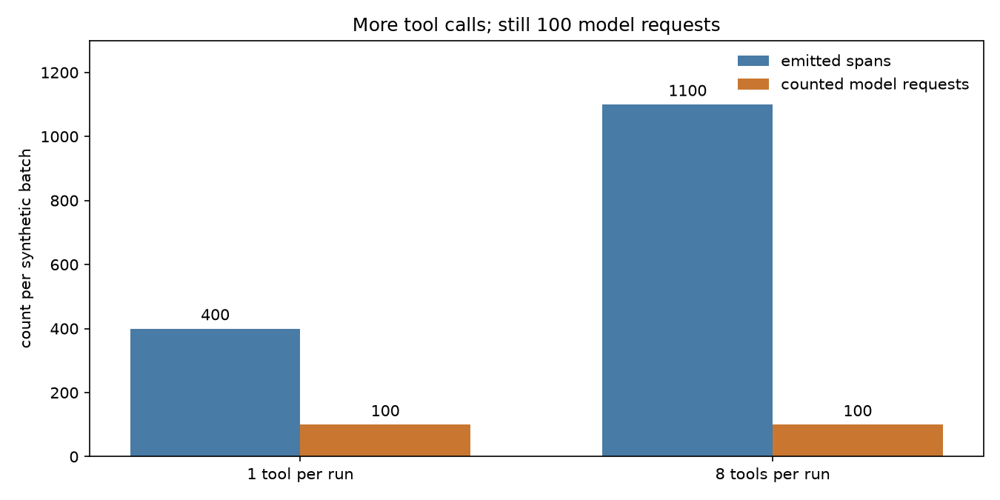

# Did More Tool Calls Increase Model Requests?

An agent can call more tools without making more model requests. Counting every
span as a request would turn that change into a false traffic increase.

## Run It

From a repository checkout, with Docker and Compose v2 running:

```sh
sh examples/demo.sh up
sh examples/demo.sh investigate
```

The first command builds inside Docker; no host Go or Python is needed. The second
emits three controlled batches and checks their counters through Prometheus. It
exits with an error if any counter fails to reconcile. It is safe to repeat against
this demo: each run checks increments on an isolated synthetic model slice.

## Observed Result

Captured on 2026-09-04. These are measurements from the live demo, not estimates
copied from the generator's expected values. [Full JSON output](results.json).

| Batch | Tool spans per run | Total emitted spans | Model requests counted | Reported tokens |
| --- | ---: | ---: | ---: | ---: |
| Baseline | 1 | 400 | 100 | 20,000 |
| More tools | 8 | 1,100 | 100 | 20,000 |



Each batch has 100 agent runs. Every run contains one root agent span, one retrieval
span, one model span, and the stated number of tool spans. The model operation is
`chat`; the other operations are `invoke_agent`, `retrieval`, and `execute_tool`.
There are no actual model or tool calls and no external API charges.

## Read It Correctly

Total spans increased 175%. Model requests and reported tokens did not change. The
configured operation filter, not the number of spans in a trace, defines the
model-request denominator. This does not prove that extra tool activity is cheap
or useful; tool latency and cost are separate questions.

To inspect the cumulative request counter after the run:

```promql
gen_ai_sketch_requests_total{slice="by_model",slice_value="gen_ai.request.model=investigation-model"}
```

The script records before/after differences. Do not expect the cumulative value to
return to 100 on each invocation. Do not sum `by_model` and `by_team_model`: they
are two views of the same requests. Run investigations one at a time on this local
demo, not against a production collector.

The workload and assertions live in [investigate.py](../../examples/app/investigate.py)
and [test_app.py](../../examples/app/test_app.py). CI repeats the live reconciliation.
The normative rules and additional fixtures are in [Accounting](../ACCOUNTING.md).

Next: [Could a token drop be missing instrumentation?](MISSING_USAGE.md)
Stop and remove disposable demo data with `sh examples/demo.sh down`.
